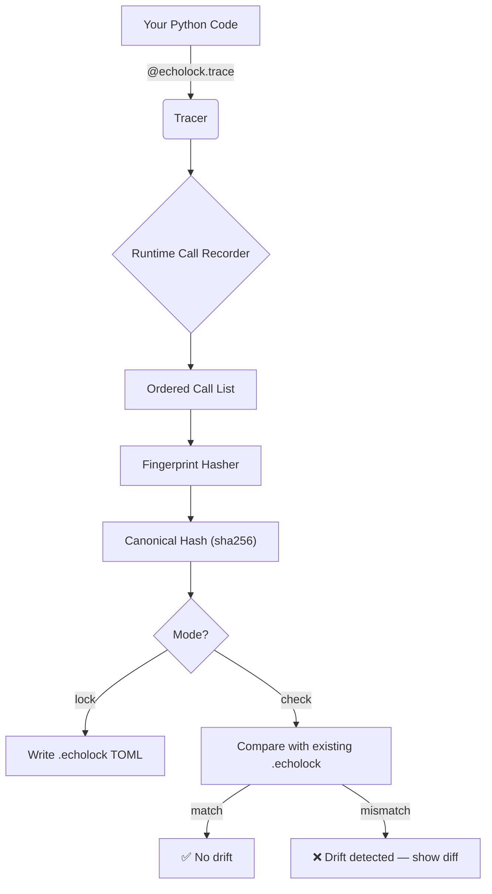
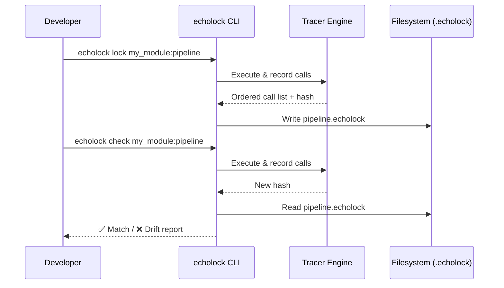

# 🔒 echolock

**Behavioral fingerprinting for Python codebases — detect silent execution‑path changes that tests miss.**

> _Scheduled and created by [hellohaven.ai](https://hellohaven.ai)_

---

## Why echolock exists

Unit tests verify **outputs**. Coverage tools verify **lines visited**. Neither catches the case where a refactor silently **reorders**, **duplicates**, or **removes** function calls along a critical path without changing the final return value.

**echolock** records _behavioral fingerprints_ — deterministic hashes of the functions actually invoked (and their call order) during a code path's execution. Save fingerprints as lockfiles, commit them, and CI will scream the moment an execution trace drifts, even if every test still passes.

Think of it as **"lock files for runtime behavior."**

---

## Features

- 🎯 **Trace capture** — decorator + context‑manager API to record call sequences
- 🔐 **Fingerprint locking** — save canonical `.echolock` TOML lockfiles
- 🔍 **Drift detection** — CLI diff of current vs. locked fingerprint with colour output
- 📊 **Rich terminal report** — see exactly which calls were added, removed, or reordered
- ⚡ **Zero‑dependency core** — only stdlib; optional `rich` for pretty printing
- 🧩 **Pluggable hashers** — sha256 (default), blake2b, md5

---

## Architecture





---

## How It Works

1. **Trace** — `echolock` installs a lightweight `sys.settrace` hook scoped to your target modules. Every function entry is recorded in order.
2. **Hash** — The ordered call list is canonicalised (module + qualname) and hashed.
3. **Lock** — The hash + call list are written to a `.echolock` TOML file you commit to version control.
4. **Check** — On every CI run (or pre‑commit), `echolock check` re‑executes the path and compares.

---

## Setup

```bash
# Clone
git clone https://github.com/DucChau/echolock.git
cd echolock

# Create venv
python3 -m venv .venv
source .venv/bin/activate   # Windows: .venv\Scripts\activate

# Install in editable mode
pip install -e .

# (Optional) Install rich for coloured output
pip install rich
```

**Requirements:** Python ≥ 3.10, no mandatory third‑party packages.

---

## Usage

### As a library

```python
from echolock import Tracer, lock, check

# Trace a function
tracer = Tracer(scope_modules=["my_app"])

with tracer:
    result = my_app.pipeline.run(data)

print(tracer.fingerprint())   # sha256 hex digest
print(tracer.calls())         # ordered list of qualified names

# Lock to file
lock(tracer, path="pipeline.echolock")

# Later — check for drift
ok, report = check(tracer, path="pipeline.echolock")
if not ok:
    print(report)
```

### As a CLI

```bash
# Lock a callable (module_path:function_name)
echolock lock demo.sample_app:run_pipeline

# Check against the lock
echolock check demo.sample_app:run_pipeline

# Show the current trace without locking
echolock trace demo.sample_app:run_pipeline

# Diff two lockfiles
echolock diff pipeline.echolock pipeline_v2.echolock
```

### Decorator style

```python
from echolock import trace

@trace(scope=["my_app"], lockfile="handler.echolock")
def handle_request(req):
    ...
```

---

## Example

```bash
$ echolock lock demo.sample_app:run_pipeline
🔒 Locked 12 calls → pipeline.echolock (sha256: a3f7c2...)

$ # ... someone refactors internals ...

$ echolock check demo.sample_app:run_pipeline
❌ Drift detected in pipeline.echolock!

   Expected: a3f7c2...
   Got:      e91b04...

   + demo.sample_app.validate_schema   (new call at position 3)
   - demo.sample_app.normalize_keys    (removed from position 5)
   ~ demo.sample_app.emit_event        (moved: position 8 → 4)
```

---

## Project Structure

```
echolock/
├── src/
│   └── echolock/
│       ├── __init__.py
│       ├── tracer.py        # sys.settrace-based call recorder
│       ├── fingerprint.py   # hashing & canonical form
│       ├── lockfile.py      # TOML read/write for .echolock files
│       ├── diff.py          # structural diff engine
│       ├── cli.py           # CLI entrypoint (argparse)
│       └── decorator.py     # @trace decorator API
├── demo/
│   ├── __init__.py
│   └── sample_app.py        # demo pipeline for testing
├── tests/
│   ├── __init__.py
│   ├── test_tracer.py
│   ├── test_fingerprint.py
│   └── test_lockfile.py
├── pyproject.toml
├── LICENSE
└── README.md
```

---

## Future Improvements

- 🔌 **pytest plugin** — `pytest --echolock` to auto‑check all locked paths
- 📈 **Flame‑graph view** — render call traces as interactive HTML flamegraphs
- 🏷️ **Argument hashing** — optionally include arg types/values in the fingerprint
- 🌲 **Call‑tree mode** — capture nesting depth, not just flat order
- 🤖 **Pre‑commit hook** — auto‑run `echolock check` on staged files
- 📦 **PyPI release** — publish as `echolock` package

---

## License

MIT — see [LICENSE](LICENSE).
